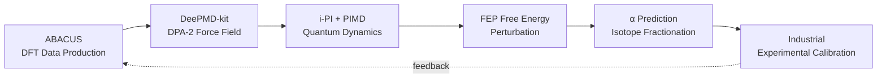

# AI4S Isotope — Cross-Scale Prediction Platform for Anomalous Isotope Effects

AI-driven prediction of low-temperature condensed-phase isotope fractionation coefficients by training neural network potential energy surfaces that replace traditional DFT, reducing O(N³) to O(N) while preserving quantum mechanical accuracy via path integral molecular dynamics (PIMD).

**2024.11 – 2025.06**

## Architecture



## Target Systems

| System | Central Isotope | Key Vibrational Mode | Functional |
|--------|----------------|---------------------|------------|
| BF₃ | ¹⁰B/¹¹B | ν₂ out-of-plane bend | SCAN+rVV10 |
| CF₄ | ¹²C/¹³C | ν₃ stretch / ν₄ bend | PBE0-D3(BJ) |
| UF₆ | ²³⁵U/²³⁸U | ν₃ stretch / ν₄ bend | PBE0-D3(BJ) + relativistic PP |

## Data Anonymization Notice

**Training data is sourced from proprietary industrial isotope separation facilities and is not included in this repository.** This repository provides complete code, configuration templates, and mock data for demonstration. All atomic coordinates in template files have been replaced with randomly perturbed values (`np.random.normal(0, 0.1, ...)`). Functional parameters and PIMD configurations are preserved at their actual production values as proof of tuning capability.

## Quick Start

```bash
# Build the Docker image
docker build -t ai4s-isotope .

# Run the container
docker run --gpus all -it ai4s-isotope

# Inside the container, run the full workflow demo
cd /workspace
bash dp_gen/run_dpgen.sh
```

## Tech Stack

- **DFT**: ABACUS 3.7 (SCAN+rVV10, PBE0-D3(BJ), relativistic pseudopotentials)
- **Force Field**: DeePMD-kit 2.2 (DPA-2 + DP-LONG), DP-GEN active learning
- **Quantum Dynamics**: i-PI 2.6 (PIMD with PILE/PIGLET thermostats)
- **Analysis**: FEP free energy perturbation, VACF power spectrum, vibrational mode decomposition

## License

MIT
